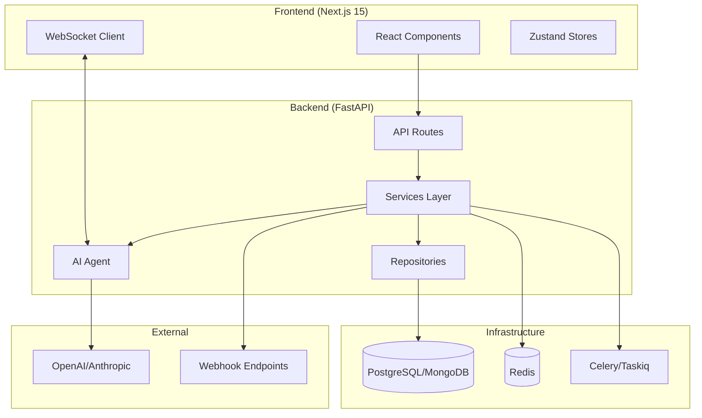
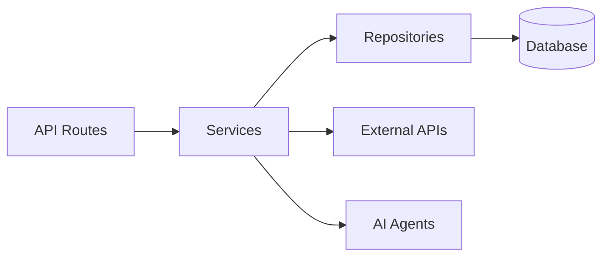
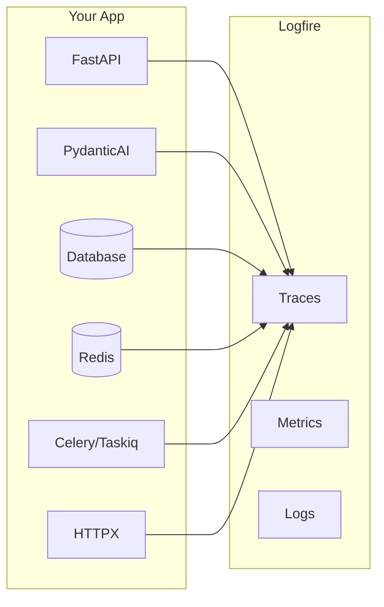

<h1 align="center">Full-Stack AI Agent Template</h1>

<p align="center">
  <b>Production-Ready AI/LLM Applications — In Minutes, Not Weeks</b>
</p>

<p align="center">
  <a href="#-quick-start">Quick Start</a> •
  <a href="#-features">Features</a> •
  <a href="#-demo">Demo</a> •
  <a href="https://pypi.org/project/fastapi-fullstack/">PyPI</a> •
  <a href="#-documentation">Docs</a>
</p>

<p align="center">
  <a href="https://pypi.org/project/fastapi-fullstack/"></a>
  <a href="https://www.python.org/"></a>
  <a href="https://github.com/vstorm-co/full-stack-fastapi-nextjs-llm-template/blob/main/LICENSE"></a>
  
  <a href="https://github.com/vstorm-co/full-stack-fastapi-nextjs-llm-template/stargazers"></a>
</p>

<p align="center">
  <b>🤖 PydanticAI</b>
  &nbsp;•&nbsp;
  <b>🦜 LangChain, LangGraph & DeepAgents</b>
  &nbsp;•&nbsp;
  <b>👥 CrewAI</b>
  &nbsp;•&nbsp;
  <b>🎯 Fully Type-Safe</b>
</p>

---

## Related Projects

> **Building advanced AI agents?** Check out [pydantic-deep](https://github.com/vstorm-co/pydantic-deepagents) - a deep agent framework built on pydantic-ai with planning, filesystem, and subagent capabilities.

---

## 🎯 Why This Template

Building AI/LLM applications requires more than just an API wrapper. You need:

- **Type-safe AI agents** with tool/function calling
- **Real-time streaming** responses via WebSocket
- **Conversation persistence** and history management
- **Production infrastructure** - auth, rate limiting, observability
- **Enterprise integrations** - background tasks, webhooks, admin panels

This template gives you all of that out of the box, with **20+ configurable integrations** so you can focus on building your AI product, not boilerplate.

### Perfect For

- 🤖 **AI Chatbots & Assistants** - PydanticAI or LangChain agents with streaming responses
- 📊 **ML Applications** - Background task processing with Celery/Taskiq
- 🏢 **Enterprise SaaS** - Full auth, admin panel, webhooks, and more
- 🚀 **Startups** - Ship fast with production-ready infrastructure

### AI-Agent Friendly

Generated projects include **CLAUDE.md** and **AGENTS.md** files optimized for AI coding assistants (Claude Code, Codex, Copilot, Cursor, Zed). Following [progressive disclosure](https://humanlayer.dev/blog/writing-a-good-claude-md) best practices - concise project overview with pointers to detailed docs when needed.

---

## ✨ Features

<p align="center">
  <a href="https://ai.pydantic.dev"></a>
  <a href="https://python.langchain.com"></a>
  <a href="https://langchain-ai.github.io/langgraph/"></a>
  <a href="https://www.crewai.com"></a>
  <a href="https://openai.com"></a>
  <a href="https://anthropic.com"></a>
  <a href="https://openrouter.ai"></a>
</p>

<p align="center">
  <a href="https://fastapi.tiangolo.com"></a>
  <a href="https://nextjs.org"></a>
  <a href="https://react.dev"></a>
  <a href="https://www.typescriptlang.org"></a>
  <a href="https://tailwindcss.com"></a>
  <a href="https://www.sqlalchemy.org"></a>
</p>

<p align="center">
  <a href="https://www.postgresql.org"></a>
  <a href="https://www.mongodb.com"></a>
  <a href="https://redis.io"></a>
  <a href="https://docs.celeryq.dev"></a>
  <a href="https://logfire.pydantic.dev"></a>
  <a href="https://sentry.io"></a>
  <a href="https://prometheus.io"></a>
</p>

<p align="center">
  <a href="https://www.docker.com"></a>
  <a href="https://kubernetes.io"></a>
  <a href="https://github.com/features/actions"></a>
  <a href="https://aws.amazon.com/s3/"></a>
</p>

### 🤖 AI/LLM First

- **[PydanticAI](https://ai.pydantic.dev)** or **[LangChain](https://python.langchain.com)** - Choose your preferred AI framework
- **WebSocket Streaming** - Real-time responses with full event access
- **Conversation Persistence** - Save chat history to database
- **Custom Tools** - Easily extend agent capabilities
- **Multi-provider Support** - OpenAI, Anthropic, OpenRouter
- **Observability** - Logfire for PydanticAI, LangSmith for LangChain

### ⚡ Backend (FastAPI)

- **[FastAPI](https://fastapi.tiangolo.com)** + **[Pydantic v2](https://docs.pydantic.dev)** - High-performance async API
- **Multiple Databases** - PostgreSQL (async), MongoDB (async), SQLite
- **Authentication** - JWT + Refresh tokens, API Keys, OAuth2 (Google)
- **Background Tasks** - Celery, Taskiq, or ARQ
- **Django-style CLI** - Custom management commands with auto-discovery

### 🎨 Frontend (Next.js 15)

- **React 19** + **TypeScript** + **Tailwind CSS v4**
- **AI Chat Interface** - WebSocket streaming, tool call visualization
- **Authentication** - HTTP-only cookies, auto-refresh
- **Dark Mode** + **i18n** (optional)

### 🔌 20+ Enterprise Integrations

| Category | Integrations |
|----------|-------------|
| **AI Frameworks** | PydanticAI, LangChain |
| **Caching & State** | Redis, fastapi-cache2 |
| **Security** | Rate limiting, CORS, CSRF protection |
| **Observability** | Logfire, LangSmith, Sentry, Prometheus |
| **Admin** | SQLAdmin panel with auth |
| **Events** | Webhooks, WebSockets |
| **DevOps** | Docker, GitHub Actions, GitLab CI, Kubernetes |

---

## 🎬 Demo

<p align="center">
  
</p>

---

## 🚀 Quick Start

### Installation

```bash
# pip
pip install fastapi-fullstack

# uv (recommended)
uv tool install fastapi-fullstack

# pipx
pipx install fastapi-fullstack
```

### Create Your Project

```bash
# Interactive wizard (recommended)
fastapi-fullstack new

# Quick mode with options
fastapi-fullstack create my_ai_app \
  --database postgresql \
  --auth jwt \
  --frontend nextjs

# Use presets for common setups
fastapi-fullstack create my_ai_app --preset production   # Full production setup
fastapi-fullstack create my_ai_app --preset ai-agent     # AI agent with streaming

# Minimal project (no extras)
fastapi-fullstack create my_ai_app --minimal
```

### Start Development

After generating your project, follow these steps:

#### 1. Install dependencies

```bash
cd my_ai_app
make install
```

> **Windows Users:** The `make` command requires GNU Make which is not available by default on Windows.
> Install via [Chocolatey](https://chocolatey.org/) (`choco install make`), use WSL, or run raw commands manually.
> Each generated project includes a "Manual Commands Reference" section in its README with all commands.

#### 2. Start the database

```bash
# PostgreSQL (with Docker)
make docker-db
```

#### 3. Create and apply database migrations

> ⚠️ **Important:** Both commands are required! `db-migrate` creates the migration file, `db-upgrade` applies it to the database.

```bash
# Create initial migration (REQUIRED first time)
make db-migrate
# Enter message: "Initial migration"

# Apply migrations to create tables
make db-upgrade
```

#### 4. Create admin user

```bash
make create-admin
# Enter email and password when prompted
```

#### 5. Start the backend

```bash
make run
```

#### 6. Start the frontend (new terminal)

```bash
cd frontend
bun install
bun dev
```

**Access:**
- API: http://localhost:8000
- Docs: http://localhost:8000/docs
- Admin Panel: http://localhost:8000/admin (login with admin user)
- Frontend: http://localhost:3000

### Quick Start with Docker

Run everything in Docker:

```bash
make docker-up       # Start backend + database
make docker-frontend # Start frontend
```

### Using the Project CLI

Each generated project has a CLI named after your `project_slug`. For example, if you created `my_ai_app`:

```bash
cd backend

# The CLI command is: uv run <project_slug> <command>
uv run my_ai_app server run --reload     # Start dev server
uv run my_ai_app db migrate -m "message" # Create migration
uv run my_ai_app db upgrade              # Apply migrations
uv run my_ai_app user create-admin       # Create admin user
```

Use `make help` to see all available Makefile shortcuts.

---

## 📸 Screenshots

### Chat Interface
| Light Mode | Dark Mode |
|:---:|:---:|
|  |  |

### Authentication
| Register | Login |
|:---:|:---:|
|  |  |

### Observability
| Logfire (PydanticAI) | LangSmith (LangChain) |
|:---:|:---:|
|  |  |

### Admin, Monitoring & API
| Celery Flower | SQLAdmin Panel |
|:---:|:---:|
|  |  |

| API Documentation |
|:---:|
|  |

---

## 🏗️ Architecture



### Layered Architecture

The backend follows a clean **Repository + Service** pattern:



| Layer | Responsibility |
|-------|---------------|
| **Routes** | HTTP handling, validation, auth |
| **Services** | Business logic, orchestration |
| **Repositories** | Data access, queries |

See [Architecture Documentation](https://github.com/vstorm-co/full-stack-fastapi-nextjs-llm-template/blob/main/docs/architecture.md) for details.

---

## 🤖 AI Agent

Choose between **PydanticAI** or **LangChain** when generating your project, with support for multiple LLM providers:

```bash
# PydanticAI with OpenAI (default)
fastapi-fullstack create my_app --ai-agent --ai-framework pydantic_ai

# PydanticAI with Anthropic
fastapi-fullstack create my_app --ai-agent --ai-framework pydantic_ai --llm-provider anthropic

# PydanticAI with OpenRouter
fastapi-fullstack create my_app --ai-agent --ai-framework pydantic_ai --llm-provider openrouter

# LangChain with OpenAI
fastapi-fullstack create my_app --ai-agent --ai-framework langchain

# LangChain with Anthropic
fastapi-fullstack create my_app --ai-agent --ai-framework langchain --llm-provider anthropic
```

### Supported LLM Providers

| Framework | OpenAI | Anthropic | OpenRouter |
|-----------|:------:|:---------:|:----------:|
| **PydanticAI** | ✓ | ✓ | ✓ |
| **LangChain** | ✓ | ✓ | - |

### PydanticAI Integration

Type-safe agents with full dependency injection:

```python
# app/agents/assistant.py
from pydantic_ai import Agent, RunContext

@dataclass
class Deps:
    user_id: str | None = None
    db: AsyncSession | None = None

agent = Agent[Deps, str](
    model="openai:gpt-4o-mini",
    system_prompt="You are a helpful assistant.",
)

@agent.tool
async def search_database(ctx: RunContext[Deps], query: str) -> list[dict]:
    """Search the database for relevant information."""
    # Access user context and database via ctx.deps
    ...
```

### LangChain Integration

Flexible agents with LangGraph:

```python
# app/agents/langchain_assistant.py
from langchain.tools import tool
from langgraph.prebuilt import create_react_agent

@tool
def search_database(query: str) -> list[dict]:
    """Search the database for relevant information."""
    ...

agent = create_react_agent(
    model=ChatOpenAI(model="gpt-4o-mini"),
    tools=[search_database],
    prompt="You are a helpful assistant.",
)
```

### WebSocket Streaming

Both frameworks use the same WebSocket endpoint with real-time streaming:

```python
@router.websocket("/ws")
async def agent_ws(websocket: WebSocket):
    await websocket.accept()

    # Works with both PydanticAI and LangChain
    async for event in agent.stream(user_input):
        await websocket.send_json({
            "type": "text_delta",
            "content": event.content
        })
```

### Observability

Each framework has its own observability solution:

| Framework | Observability | Dashboard |
|-----------|--------------|-----------|
| **PydanticAI** | [Logfire](https://logfire.pydantic.dev) | Agent runs, tool calls, token usage |
| **LangChain** | [LangSmith](https://smith.langchain.com) | Traces, feedback, datasets |

See [AI Agent Documentation](https://github.com/vstorm-co/full-stack-fastapi-nextjs-llm-template/blob/main/docs/ai-agent.md) for more.

---

## 📊 Observability

### Logfire (for PydanticAI)

[Logfire](https://logfire.pydantic.dev) provides complete observability for your application - from AI agents to database queries. Built by the Pydantic team, it offers first-class support for the entire Python ecosystem.



| Component | What You See |
|-----------|-------------|
| **PydanticAI** | Agent runs, tool calls, LLM requests, token usage, streaming events |
| **FastAPI** | Request/response traces, latency, status codes, route performance |
| **PostgreSQL/MongoDB** | Query execution time, slow queries, connection pool stats |
| **Redis** | Cache hits/misses, command latency, key patterns |
| **Celery/Taskiq** | Task execution, queue depth, worker performance |
| **HTTPX** | External API calls, response times, error rates |

### LangSmith (for LangChain)

[LangSmith](https://smith.langchain.com) provides observability specifically designed for LangChain applications:

| Feature | Description |
|---------|-------------|
| **Traces** | Full execution traces for agent runs and chains |
| **Feedback** | Collect user feedback on agent responses |
| **Datasets** | Build evaluation datasets from production data |
| **Monitoring** | Track latency, errors, and token usage |

LangSmith is automatically configured when you choose LangChain:

```bash
# .env
LANGCHAIN_TRACING_V2=true
LANGCHAIN_API_KEY=your-api-key
LANGCHAIN_PROJECT=my_project
```

### Configuration

Enable Logfire and select which components to instrument:

```bash
fastapi-fullstack new
# ✓ Enable Logfire observability
#   ✓ Instrument FastAPI
#   ✓ Instrument Database
#   ✓ Instrument Redis
#   ✓ Instrument Celery
#   ✓ Instrument HTTPX
```

### Usage

```python
# Automatic instrumentation in app/main.py
import logfire

logfire.configure()
logfire.instrument_fastapi(app)
logfire.instrument_asyncpg()
logfire.instrument_redis()
logfire.instrument_httpx()
```

```python
# Manual spans for custom logic
with logfire.span("process_order", order_id=order.id):
    await validate_order(order)
    await charge_payment(order)
    await send_confirmation(order)
```

For more details, see [Logfire Documentation](https://logfire.pydantic.dev/docs/integrations/).

---

## 🛠️ Django-style CLI

Each generated project includes a powerful CLI inspired by Django's management commands:

### Built-in Commands

```bash
# Server
my_app server run --reload
my_app server routes

# Database (Alembic wrapper)
my_app db init
my_app db migrate -m "Add users"
my_app db upgrade

# Users
my_app user create --email admin@example.com --superuser
my_app user list
```

### Custom Commands

Create your own commands with auto-discovery:

```python
# app/commands/seed.py
from app.commands import command, success, error
import click

@command("seed", help="Seed database with test data")
@click.option("--count", "-c", default=10, type=int)
@click.option("--dry-run", is_flag=True)
def seed_database(count: int, dry_run: bool):
    """Seed the database with sample data."""
    if dry_run:
        info(f"[DRY RUN] Would create {count} records")
        return

    # Your logic here
    success(f"Created {count} records!")
```

Commands are **automatically discovered** from `app/commands/` - just create a file and use the `@command` decorator.

```bash
my_app cmd seed --count 100
my_app cmd seed --dry-run
```

---

## 📁 Generated Project Structure

```
my_project/
├── backend/
│   ├── app/
│   │   ├── main.py              # FastAPI app with lifespan
│   │   ├── api/
│   │   │   ├── routes/v1/       # Versioned API endpoints
│   │   │   ├── deps.py          # Dependency injection
│   │   │   └── router.py        # Route aggregation
│   │   ├── core/                # Config, security, middleware
│   │   ├── db/models/           # SQLAlchemy/MongoDB models
│   │   ├── schemas/             # Pydantic schemas
│   │   ├── repositories/        # Data access layer
│   │   ├── services/            # Business logic
│   │   ├── agents/              # AI agents with centralized prompts
│   │   ├── commands/            # Django-style CLI commands
│   │   └── worker/              # Background tasks
│   ├── cli/                     # Project CLI
│   ├── tests/                   # pytest test suite
│   └── alembic/                 # Database migrations
├── frontend/
│   ├── src/
│   │   ├── app/                 # Next.js App Router
│   │   ├── components/          # React components
│   │   ├── hooks/               # useChat, useWebSocket, etc.
│   │   └── stores/              # Zustand state management
│   └── e2e/                     # Playwright tests
├── docker-compose.yml
├── Makefile
└── README.md
```

Generated projects include version metadata in `pyproject.toml` for tracking:

```toml
[tool.fastapi-fullstack]
generator_version = "0.1.5"
generated_at = "2024-12-21T10:30:00+00:00"
```

---

## ⚙️ Configuration Options

### Core Options

| Option | Values | Description |
|--------|--------|-------------|
| **Database** | `postgresql`, `mongodb`, `sqlite`, `none` | Async by default |
| **ORM** | `sqlalchemy`, `sqlmodel` | SQLModel for simplified syntax |
| **Auth** | `jwt`, `api_key`, `both`, `none` | JWT includes user management |
| **OAuth** | `none`, `google` | Social login |
| **AI Framework** | `pydantic_ai`, `langchain` | Choose your AI agent framework |
| **LLM Provider** | `openai`, `anthropic`, `openrouter` | OpenRouter only with PydanticAI |
| **Background Tasks** | `none`, `celery`, `taskiq`, `arq` | Distributed queues |
| **Frontend** | `none`, `nextjs` | Next.js 15 + React 19 |

### Presets

| Preset | Description |
|--------|-------------|
| `--preset production` | Full production setup with Redis, Sentry, Kubernetes, Prometheus |
| `--preset ai-agent` | AI agent with WebSocket streaming and conversation persistence |
| `--minimal` | Minimal project with no extras |

### Integrations

Select what you need:

```bash
fastapi-fullstack new
# ✓ Redis (caching/sessions)
# ✓ Rate limiting (slowapi)
# ✓ Pagination (fastapi-pagination)
# ✓ Admin Panel (SQLAdmin)
# ✓ AI Agent (PydanticAI or LangChain)
# ✓ Webhooks
# ✓ Sentry
# ✓ Logfire / LangSmith
# ✓ Prometheus
# ... and more
```

---

## 📚 Documentation

| Document | Description |
|----------|-------------|
| [Architecture](https://github.com/vstorm-co/full-stack-fastapi-nextjs-llm-template/blob/main/docs/architecture.md) | Repository + Service pattern, layered design |
| [Frontend](https://github.com/vstorm-co/full-stack-fastapi-nextjs-llm-template/blob/main/docs/frontend.md) | Next.js setup, auth, state management |
| [AI Agent](https://github.com/vstorm-co/full-stack-fastapi-nextjs-llm-template/blob/main/docs/ai-agent.md) | PydanticAI, tools, WebSocket streaming |
| [Observability](https://github.com/vstorm-co/full-stack-fastapi-nextjs-llm-template/blob/main/docs/observability.md) | Logfire integration, tracing, metrics |
| [Deployment](https://github.com/vstorm-co/full-stack-fastapi-nextjs-llm-template/blob/main/docs/deployment.md) | Docker, Kubernetes, production setup |
| [Development](https://github.com/vstorm-co/full-stack-fastapi-nextjs-llm-template/blob/main/docs/development.md) | Local setup, testing, debugging |
| [Changelog](https://github.com/vstorm-co/full-stack-fastapi-nextjs-llm-template/blob/main/docs/CHANGELOG.md) | Version history and release notes |

---

## Star History

[](https://www.star-history.com/#vstorm-co/full-stack-fastapi-nextjs-llm-template&type=date&legend=top-left)

---

## 🙏 Inspiration

This project is inspired by:

- [full-stack-fastapi-template](https://github.com/fastapi/full-stack-fastapi-template) by @tiangolo
- [fastapi-template](https://github.com/s3rius/fastapi-template) by @s3rius
- [FastAPI Best Practices](https://github.com/zhanymkanov/fastapi-best-practices) by @zhanymkanov
- Django's management commands system

---

## 🤝 Contributing

Contributions are welcome! Please read our [Contributing Guide](https://github.com/vstorm-co/full-stack-fastapi-nextjs-llm-template/blob/main/CONTRIBUTING.md) for details.

---

## 📄 License

MIT License - see [LICENSE](https://github.com/vstorm-co/full-stack-fastapi-nextjs-llm-template/blob/main/LICENSE) for details.

---

<p align="center">
  Made with ❤️ by <a href="https://github.com/vstorm-co">VStorm</a>
</p>
