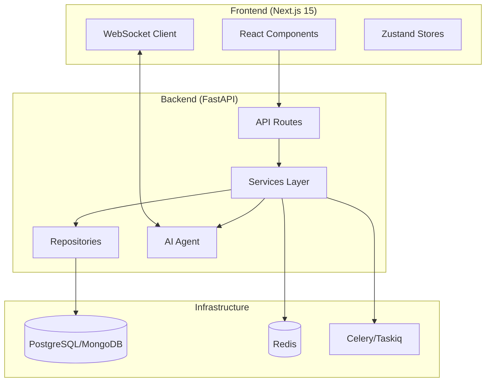

# Core Concepts

FastAPI Fullstack generates production-ready applications with a clean, layered architecture.

## Architecture Overview



## Key Concepts

<div class="grid cards" markdown>

-   :material-layers-outline: **[Architecture](../architecture.md)**

    ---

    Repository + Service pattern, dependency injection, and layered design.

-   :material-robot: **[AI Agents](../ai-agent.md)**

    ---

    PydanticAI, LangChain, LangGraph, CrewAI with WebSocket streaming.

-   :material-react: **[Frontend](../frontend.md)**

    ---

    Next.js 15, React 19, TypeScript, Tailwind CSS, and Zustand.

</div>

## Design Principles

### 1. Separation of Concerns

Each layer has a single responsibility:

| Layer | Responsibility |
|-------|---------------|
| **Routes** | HTTP handling, validation, auth |
| **Services** | Business logic, orchestration |
| **Repositories** | Data access, queries |

### 2. Dependency Injection

FastAPI's dependency injection system is used throughout:

```python
@router.get("/users/{user_id}")
async def get_user(
    user_id: int,
    service: UserService = Depends(get_user_service),
) -> UserResponse:
    return await service.get_user(user_id)
```

### 3. Type Safety

Full type annotations with Pydantic models:

```python
class UserCreate(BaseModel):
    email: EmailStr
    password: str

class UserResponse(BaseModel):
    id: int
    email: EmailStr
    created_at: datetime
```

## Next Steps

- [Architecture](../architecture.md) - Deep dive into project structure
- [AI Agents](../ai-agent.md) - Configure AI frameworks
- [Frontend](../frontend.md) - Frontend architecture and patterns
